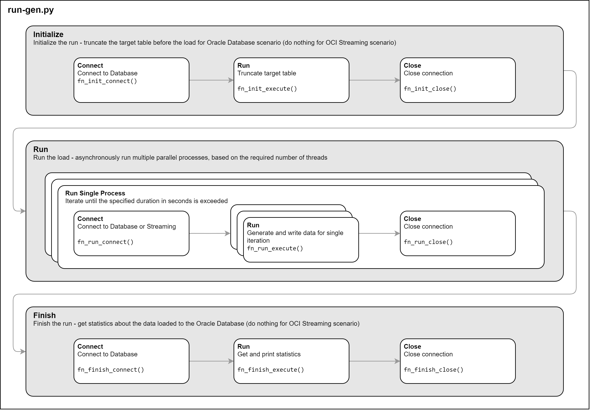
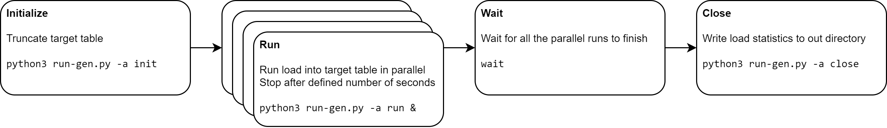

# __load-generator__

## Purpose

The main purpose of the `load-generator` is to generate and test parallel data ingestion
workload into Oracle Database.

Similar workload might be coming from IoT use cases, where the requirement is to ingest
large data volumes with minimal latency, so that data is available for querying and
analysis without the need to batch it outside the database.


## Scenarios

The `load-generator` supports the following scenarios:

* __single__ - Records are inserted into the database one-by-one and immediately committed.
* __batch__ - Records are inserted into the database one-by-one and committed after a batch of records is inserted.
* __array__ - Records are inserted into the database in arrays and committed after every array insert.
* __fast__ - Records are inserted into the database in arrays using the Fast Ingest available in Oracle Database 19c.


## Data Model

The `load-generator` uses a simple data model with JSON payload and several metadata columns.

```
create table gl_stream (
  id varchar2(40) not null,
  run_id varchar2(40) not null,
  scenario varchar2(20) not null,
  ts timestamp not null,
  payload varchar2(4000),
  constraint gl_stream_is_json check (payload is json)
);
```

Payload is a JSON document corresponding to General Ledger journal lines. Data is randomly generated.


## Generator

The `load-generator` consists of two programs:

* `run-gen.py` is a single-threaded Python3 program that generates data and inserts them
into the database according to the selected scenario. It finishes after required time. The
program uses `python-oracledb` to connect to Oracle Database.

* `run-gen.sh` is a driver program, which initializes the load, runs required number of
`run-gen.py` instances in parallel, and produces the statistics.


### `run-gen.py`

The actions performed by the generator program `run-gen.py` are:



* __Connect__ - Open the database connection and create cursor.
* __Iterate__ - Iterate until the specified duration in seconds is exceeded.
* __Run__ - Every iteration consists of 1. generating the array of records and 2. writing the records to the database.
* __Close__ - Close the cursor and database connection.

Note that procedures `fn_connect()`, `fn_run()`, and `fn_close()` differs according to
the scenario. Particularly, for the Fast Ingest (scenario `fast`), it is necessary to
enable hints in the beginning and to flush the cache at the end.


### `run-gen.sh`

The actions performed by the driver program `run-gen.sh` are:



* __Initialize__ - Truncate the target table by calling `run-gen.py -a init`.
* __Run__ - Run defined number of load instances by calling `run-gen.py -a run &`.
* __Wait__ - Wait for all load instances to finish.
* __Close__ - Produce run statistics to out directory by calling `run-gen.py -a close`.

The output statistics are written into the `out` directory. Any errors are written into
the `err` directory.


## Parameters

The program `run-gen.py` is parameterized by the following parameters:

* __action__ - Action to perform (init|run|close).
* __scenario__ - Scenario (single|batch|array|fast).
* __size__ - Configuration of the database instance, to compare multiple configurations.
* __threads__ - Number of parallel threads.
* __thread__ - Number of the current thread.
* __duration__ - Duration of the run in seconds.
* __minrec__ - Minimum number of records in a journal (default = 60).
* __maxrec__ - Maximum number of records in a journal (default = 100).
* __iterations__ - Number of generated journals before they are written to the database (default = 1).
* __table__ - Target database table.
* __dbuser__ - Database user.
* __dbpwd__ - Password of the database user.
* __dbconnect__ - Database connect string.


## Output

You may use output file generated by the last step of the driver program `run-gen.sh` to
evaluate performance of the load. Example of the output (prettified) is here:

```
{
  "action": "finish",
  "scenario": "array",
  "size": "4ecpu",
  "table": "gl_stream_array",
  "threads": 4,
  "inserts": 1166613,
  "bytes": 251658240,
  "blocks": 30720,
  "start_ts": "2024/04/11 11:11:25,000000",
  "end_ts": "2024/04/11 11:12:25,000000"
}
```


## Prerequisites

Before running the `load-generator`, ensure the following prerequisites are met:

* Oracle Database 19c+ instance. Note I tested the program with Autonomous Data Warehouse Serverless (ADW).
* Compute instance with Python3, Oracle Database client, and `python-oracledb` package
* Network connectivity from the Compute instance to the Oracle Database for SQL Net (typically TCP/1521-1522).
* Database wallet for mTLS connection and configured SQL Net on the Compute instance.
* Database schema with target tables. Refer to `create-user.sql` file.
* Target table(s) deployed in the schema. Refer to `create-tables.sql` file.


## Considerations

* The Compute instance with the `load-generator` program must be sized accordingly.
Particularly for the Fast Ingest (scenario `fast`) and higher levels of parallelism, the
client Compute instance requires lot of OCPUs and sufficient network bandwidth.

* You can easily modify the procedures `get_journals()` and `get_journal_lines()` to produce
different payloads. Rest of the program does not care about the structure of the payload.

* You can easily modify the target table(s) according to your needs. For example, you can
add indexes to measure the impact of indexes on the performance. Also, you can change the
payload data type from `VARCHAR2(4000)` to `BLOB` for larger payloads, although this will
have detrimental impact on the load performance.


